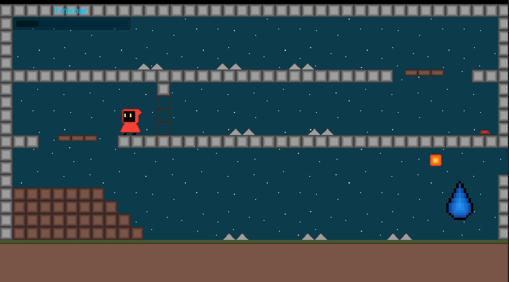

# The Essence of Water

## Description

This game was made in **2019** back when I was a Junior High School student and self-studied game development.

This project is complete.

**❗❗ THE CODE IN THIS REPOSITORY IS TERRIBLE, PROCEED WITH CAUTION ❗❗**

### Story

I made this game as a submission to a science project back in Junior High School during **2019**.

It wasn't required to make a game. Most of my classmates made drawings, PowerPoint presentations, and animations. At some point, I had this idea to use my coding skills that I self-studied from the internet. As a result of that one idea, this project came to life.

_This project gives me nostalgia_

## Preview of the Game

